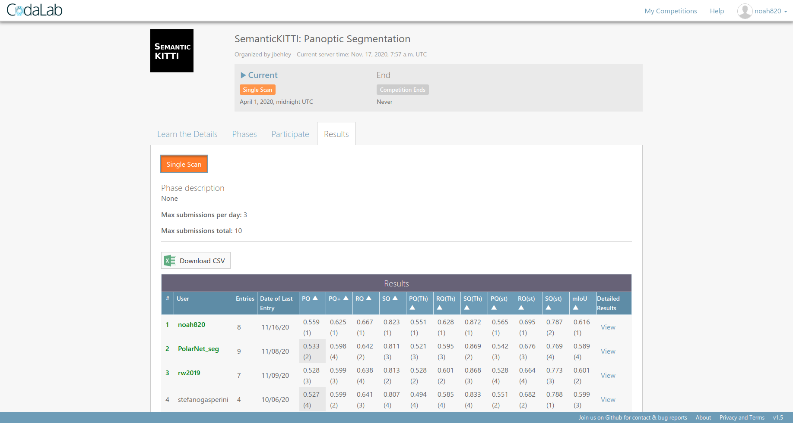

# LiDAR-based Panoptic Segmentation via Dynamic Shifting Network
The repository of our work **"LiDAR-based Panoptic Segmentation via Dynamic Shifting Network"**.


## News
- **2020-11-16** We achieve 1st place in [SemanticKITTI Panoptic Segmentation leaderboard](https://competitions.codalab.org/competitions/24025#results).



## Requirements
- easydict
- hdbscan
- numba
- numpy
- pyyaml
- python=3.7
- scikit-learn
- scipy
- spconv=1.1
- tensorboard=2.3.0
- torch=1.5
- torchvision=0.6.0
- torch-cluster=1.5.7
- torch-scatter=1.3.2
- tqdm

## Data Preperation
Please download [SemanticKITTI](http://www.semantic-kitti.org/dataset.html#overview) to folder `data` and the structure of the folder should look like:

```
./
├── 
├── ...
└── data/
    ├──sequences
        ├── 00/           
        │   ├── velodyne/	
        |   |	├── 000000.bin
        |   |	├── 000001.bin
        |   |	└── ...
        │   └── labels/ 
        |       ├── 000000.label
        |       ├── 000001.label
        |       └── ...
        ├── 08/ # for validation
        ├── 11/ # 11-21 for testing
        └── 21/
	        └── ...
```

## Training and Inferencing
The training of our DS-Net consists of three steps:

### 1. Semantic segmentation training
The training codes and scripts for this part will be released soon. We provide the pretrained model of step 1 [here](https://drive.google.com/file/d/1cGieEmsRhVD2YR3CH7TOj5H3y-4WG96q/view?usp=sharing).

### 2. Center regression training
The training scripts of this step could be found in `./scripts/release/backbone`. Before using the training scripts, please download the pretrained model of step 1 to folder `./pretrained_weight` or place the model trained by yourself to the same folder.Remenber to modify the `--pretrained_ckpt` in the training scripts. The pretrained model of step 2 could be downloaded [here](https://drive.google.com/file/d/1pimhJ8iKR518I7g7xLKOB4lLYjQ0Doyp/view?usp=sharing) which should also be put in folder `./pretrained_weight` and could be inferenced using validation scripts in folder `./scripts/release/backbone`.

### 3. Dynamic shifting training
The training scripts of step 3 could be found in `./scripts/release/dsnet`. Before using the training scripts of this part, please download the pretrained model of step 2 to folder `./pretrained_weight` or use the model trained by yourself. The pretrained model of step 3 could be downloaded from [here](https://drive.google.com/file/d/1BZTEZOUfoYvobppuOgO6DC_Hp_c6YytJ/view?usp=sharing). The pretrained model or the model trained by yourself could be inferenced on validation set or test set of SemanticKITTI using the scripts provided in folder `./scripts/release/dsnet`. The testing scripts will generate prediction files in the corresponding output folders. Note that all the pytorch distributed training scripts are not tested due to lack of proper environment. All the slurm training scripts are tested and should work well. Should there be any problems, feel free to open an issue.

## Reference
If you find our work useful in your research, please consider citing the following papers:

```
@article{hong2020lidar,
  title={LiDAR-based Panoptic Segmentation via Dynamic Shifting Network},
  author={Hong, Fangzhou and Zhou, Hui and Zhu, Xinge and Li, Hongsheng and Liu, Ziwei},
  journal={arXiv preprint arXiv:2011.11964},
  year={2020}
}

@article{zhu2020cylindrical,
  title={Cylindrical and Asymmetrical 3D Convolution Networks for LiDAR Segmentation},
  author={Zhu, Xinge and Zhou, Hui and Wang, Tai and Hong, Fangzhou and Ma, Yuexin and Li, Wei and Li, Hongsheng and Lin, Dahua},
  journal={arXiv preprint arXiv:2011.10033},
  year={2020}
}
```

## Acknowledgments
In our implementation, we refer to the following opensource databases: [PolarSeg](https://github.com/edwardzhou130/PolarSeg), [spconv](https://github.com/traveller59/spconv), [Cylinder3D](https://github.com/xinge008/Cylinder3D), [OpenPCDet](https://github.com/open-mmlab/OpenPCDet).
